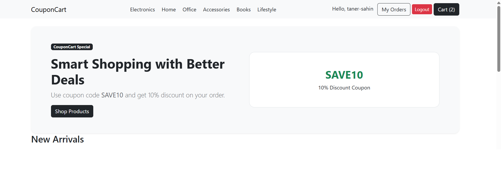
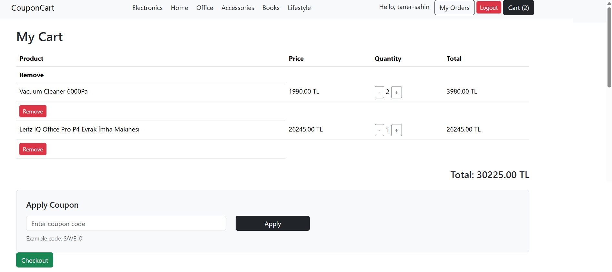

# 📦 CouponCart

CouponCart is a backend-focused Django e-commerce project that implements a complete **cart → order → coupon workflow** using a database-driven architecture.

The project focuses on real-world backend logic such as **data integrity, discount calculation, and scalable system design**, rather than visual complexity.

---

## 🖼 Project Preview

### 🏠 Home Page

### 🛒 Cart & Coupon System

---

## 🧠 About

This project is part of a structured backend development journey.

Each project in this series follows the same architecture while introducing **one core feature**.

🎯 **Focus of this project:**
> Building a fully functional coupon system integrated into the cart and checkout flow.

---

## ⚙️ Core Features

### 🔐 Authentication
- User registration, login, logout
- Protected cart and checkout operations

### 🛍 Product System
- Product listing
- Slug-based product detail pages
- Category-based filtering

### 🛒 Cart System (Database-Based)
- Add / remove / increase / decrease items
- Quantity-based item management
- User-specific cart logic
- Dynamic total price calculation

### 📦 Order System
- Cart → Order conversion
- OrderItem snapshot logic (price & name stored at purchase time)
- Automatic cart cleanup after checkout
- Order history and detail pages

### 🎟 Coupon System (Main Feature)
- Apply coupon codes in cart
- Percentage-based discount
- Coupon validation:
  - Active / inactive
  - Usage control
- Discount applied to final order total

---

## 🚀 Backend Highlights

- Database-driven cart system (NOT session-based)
- Clean architecture: Cart → Order → OrderItem
- Snapshot logic for historical data consistency
- Slug-based routing for clean URLs
- Coupon validation handled in backend
- Business logic centralized in views
- User-based data isolation
- Context processors for global data (navbar, cart count)

---

## 🔄 Business Flow

User logs in  
→ Adds products to cart  
→ Cart stored in database  
→ Applies coupon  
→ Coupon validated  
→ Discount calculated  
→ Proceeds to checkout  
→ Order is created  
→ OrderItems generated (snapshot data)  
→ Final price stored  
→ Cart is cleared  

---

## 🛠 Tech Stack

- Python
- Django
- SQLite
- Bootstrap

---

## 🧩 Project Structure

- `accounts` → authentication system  
- `products` → product & category logic  
- `cart` → database-based cart system  
- `orders` → checkout & order management  
- `coupons` → coupon validation and discount logic  
- `templates` → global templates  
- `static` → CSS, JS, images  

---

## 📚 What I Learned

- Designing a database-driven cart system
- Building scalable order architecture
- Implementing coupon validation logic
- Managing discount calculations
- Structuring backend-first Django projects
- Connecting full e-commerce flow (cart → checkout → order)

---

## 📊 Status

✅ Backend Core Completed  
🔜 Ready for deployment and further optimization

---

## 🗺 Roadmap

- Project 1 → StepCart ✅  
- Project 2 → OrderCore ✅  
- Project 3 → StockFlow ✅  
- Project 4 → CouponCart ✅  
- Project 5 → VariShop  
- Project 6 → QueryCart  

---

## 👤 Author

**Taner Sahin**  
GitHub: https://github.com/taner-sahin
